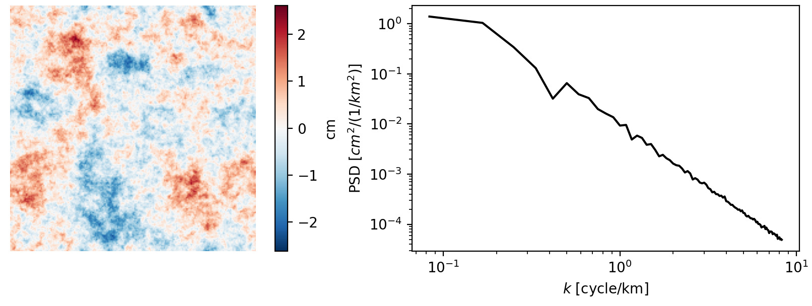

# troposim

Simulate tropospheric noise for InSAR data



## Usage

To simulate one turbulence image, you can specify the shape:
```python
from troposim import turbulence
noise = turbulence.simulate(shape=(500, 500))
```
or add a 3rd dimension to simulate a stack of images

```python
noise = turbulence.simulate(shape=(10, 500, 500))
```

The `beta` argument is the slope of the log10(power) vs log10(frequency) graph.
The default is to use a single linear slope of $\beta = 2.5$:
$$
P(f) = \frac{1}{f^\beta}
$$

For smaller-scale turbulence, you can use a different `beta`:
```python
noise = turbulence.simulate(beta=2.2)
```

Since real InSAR data typically have a power spectrum that is not a single slope, you can estimate the spectrum from an image and use that to simulate new data:
```python
p0, beta, freq, psd1d = turbulence.get_psd(noise, freq0=1e-4)
```
Here the return values are
- `p0`: the power at the reference frequency `freq0`
- `beta`: a numpy Polynomial which was fit to the log-log PSD

The other two values can be used to plot the estimated PSD:
```python
# assuming maptlotlib is installed
from troposim import plotting 
plotting.plot_psd1d(freq, psd1d)
```

To simulate a stack of new values, you can pass the estimated `p0` and `beta` back to `simulate`:
```python
noise = turbulence.simulate(shape=(10, 400, 400), p0=p0, beta=beta)
```
Note that the default fit will use a cubic polynomial. 
To request only a linear fit,
```python
turbulence.get_psd(noise, deg=1)
```