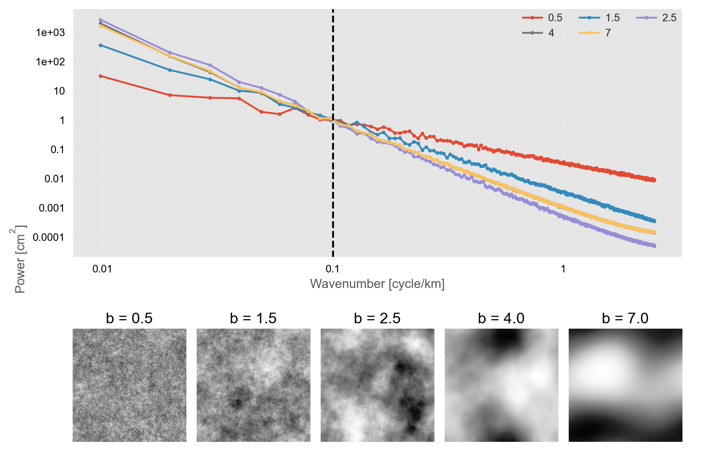
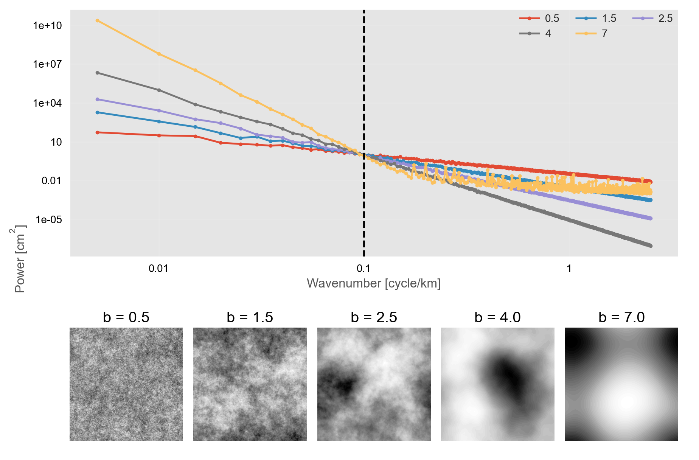

# Changes made from fractal.py in MintPy

- Removed the power-of-2 constraint for grabbing a square of data to average:
```
`N = min(data.shape)
# get max square size in a power of 2
N = np.power(2, int(np.log2(N)))
```

For slopes of $\beta > 2.5$, this was not taking a large enough chunk of the image when using, e.g. a 1000x1000 image (since this would cut it down to 512x512)

Before:


Removing this constraint allows the slope to be estimated better for more highly correlated noise

After:



- Use float64 as the datatype

The speedups from `float32` were not huge (maybe 20% faster), but for most settings I tried, the values would clip during the generation.
For example, in a 1000x1000 image, there would be only ~500 unique values in the output. 
It wasn't always visible with `imshow`, but it was obvious from plotting a histogram of values.
 

- Redo kx, kx and radial k vectors, and do `real` instead of `abs()` before subtracting mean of surface

For some reason, kx/ky creation was making the outputs have a strange checkerboard patterns in the real/imag portions.
This when away when you took the `abs`, but it was unclear why it happened and why you couldn't just take the real part of the ifft (which should be guaranteed real since you're starting with real data and only scaling the magnitude symmetrically)
